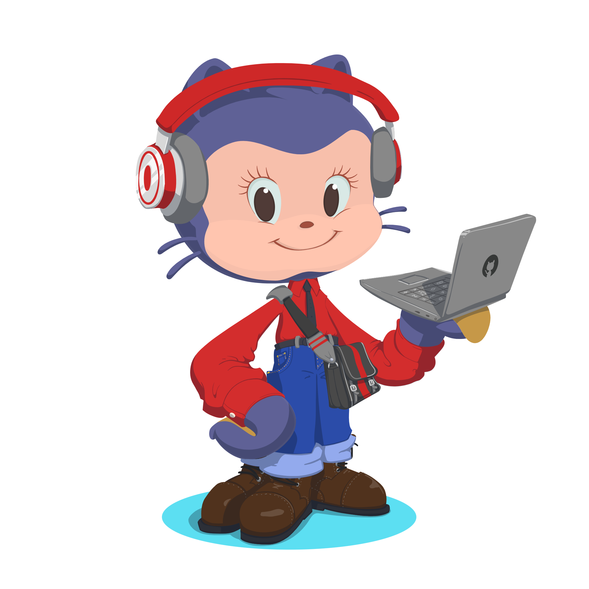

<!-- ===================================================== -->
<!-- Header Wave -->

<h1 align="center">
  
  Hey, I'm Ahmad Zain
</h1>

🎓 B.Sc. Mathematics @ Loyola College, Chennai 
💻 Software Developer @ Verizon India 
🧠 Math · Systems · Backend Engineering · Data Enthusiast 
♟️ Chess | 📊 Data | 🛠️ Low-level C

 

  

## About me

I'm a mathematics student turned software developer who enjoys building things close to the system as much as working with data and backend logic.

I like:
- writing **clean, structured C programs** (file handling, CLI tools)
- designing **backend services** with proper separation of concerns (Spring Boot)
- applying **mathematical thinking** to problem-solving and code design

Currently working full-time as a **Junior Software Developer at Verizon**, while continuously building and refining personal projects.

  

##  Tech Stack

  
  
  
  
  
  
  
  
  
  
  
  
  
  
  
  
  
  
  
  
  
  
  
  

  

## 🔭 Featured projects

### 🔐 **Simple Cyber Toolkit (C)**
CLI toolkit in pure C — modular structure, user/admin roles, focused on readable file-handling and a clean Makefile.

### 🔁 **OpenSSL SHA-256 Demo (C)**
Small demo showing SHA-256 hashing using OpenSSL (MSYS2/Windows). Emphasizes correct memory handling and clear explanation of `unsigned char` usage.

> Full project list and README files are in my repositories — explore to see code, Makefiles, and examples.

  

## 🏆 Achievements & Certificates

- Qualified **Regional Mathematics Olympiad (RMO)** and appeared for **INMO**  
- First prize — **Chess (team event)**  
- **Best Volunteer** — Loyola Outreach Programme  
- IBM: **Artificial Intelligence Fundamentals**  
- NPTEL: **Data Analytics with Python**

  

## 📈 GitHub

  

   
  
  

  

## 📫 Connect

  

> *“Mathematics teaches how to think; programming teaches how to build.”*

  

